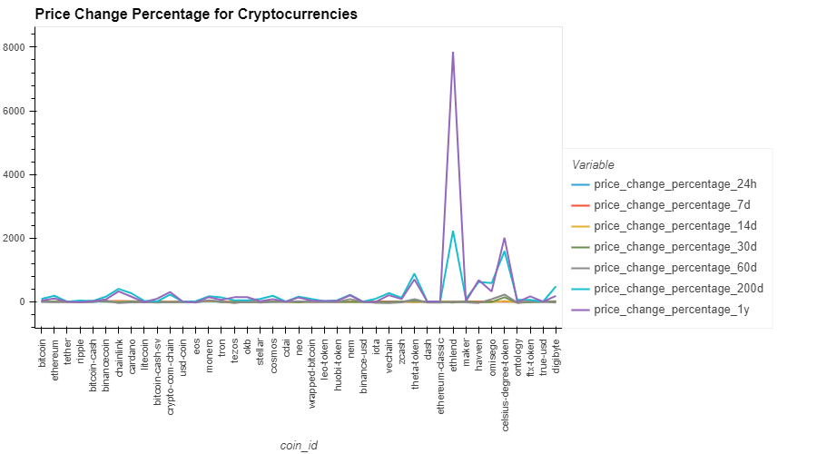
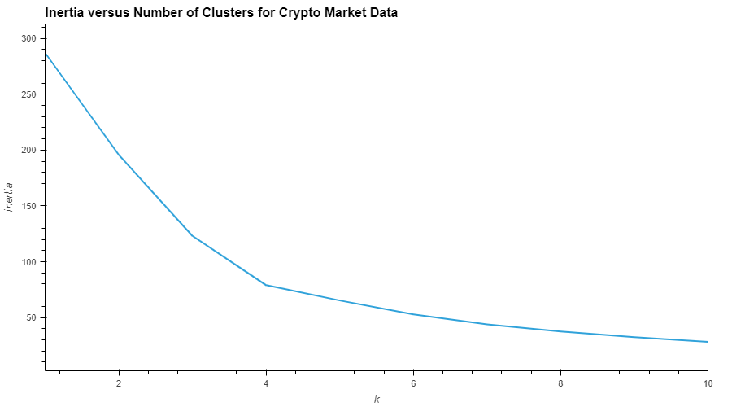
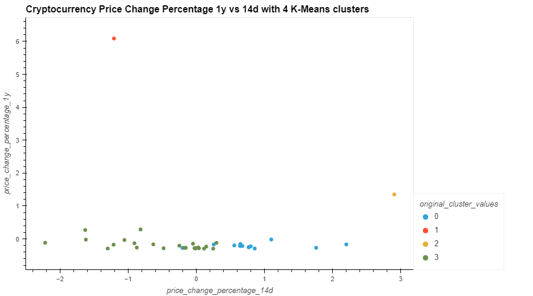
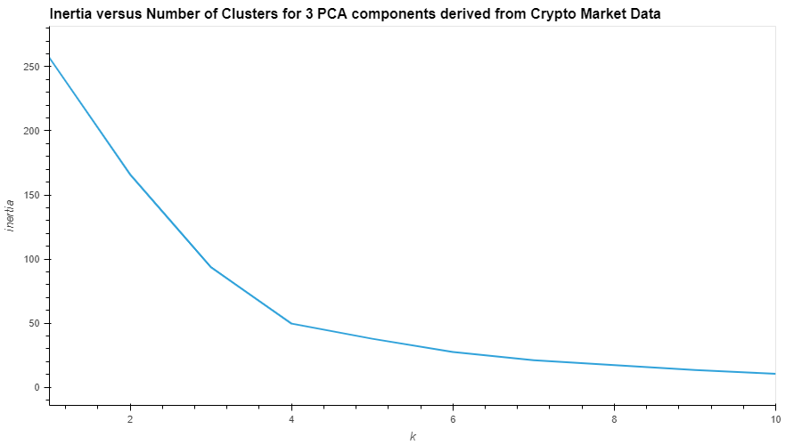
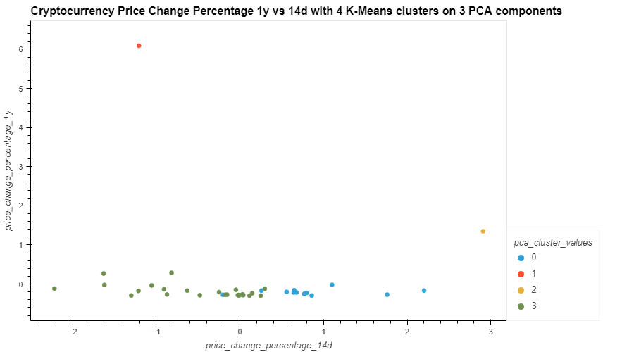
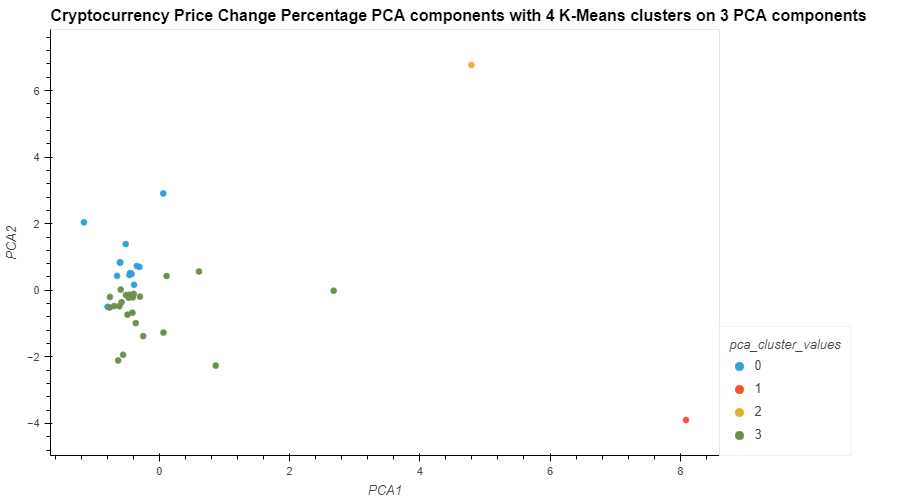

# Crypto Analyzer Using K-Means and PCA
Optimize Crypto Investment portfolio using K-Means and PCA.

## Price Change Percentage for various Cryptos
This indicates that there is something special about:
* ethlend
* celsius-degree-token

They have the two highest 1 year and 200 day price change percentages.



## K-Means Clustering:
### Using Original Features
#### Inertia vs k using original features
This indicates that a k value of 4 is optimal when we use the original features



#### Analysis of K-means clusters with k=4 using Percentage Change over 1y vs 14d
This indicates that:
* ethlend (red) has a special cluster which has one of the lowest 14 day change and the highest 1 year change.
* celsius-degree-token (yellow) has a special cluster which has the highest 14 day change and the 2nd highest 1 year change.



### After reducing features to 3 using PCA.
89.5% of the total original variance is explained by the 3 components. 

#### Inertia vs k using PCA reduced features
This indicates, similar to k means clustering on original features, that a k value of 4 is optimal when we reduced the original features to 3 using PCA.



#### Analysis of K-means clusters with k=4 using Percentage Change of 1y vs 14d
This indicates, similar to the K-means clustering on original features, that:
* ethlend (red) has a special cluster which has one of the lowest 14 day change and the highest 1 year change.
* celsius-degree-token (yellow) has a special cluster which has the highest 14 day change and the 2nd highest 1 year change.



#### Analysis of K-means clusters with k=4 using Principal Components 1 and 2
This indicates that:
* ethlend (red) has a special cluster with the highest PCA1 value and lowest PCA2 value
* celsius-degree-token (yellow) has a special cluster which has the 2nd highest PCA1 value and the highest PCA2 value.



## Conclusions
* The clustering is the same if we use the original features or the PCA reduced features. This makes sense because PCA components explain almost 90% of the original variance
* ethlend and celsius-degree-token are indicated as special by the clustering.
* ethlend and celsius-degree-token have the two highest price change percentage over 1 year.

---

## Technologies

This project uses python 3.7 along with the following packages:

* [JupyterLab](https://jupyterlab.readthedocs.io/en/stable/) - Web based user interface for data analysis.

* [pandas](https://github.com/pandas-dev/pandas) - Data analysis and manipulation library.

* [sklearn](https://github.com/scikit-learn/scikit-learn) - Python module for machine learning built on top of SciPy.

* [hvplot](https://hvplot.holoviz.org/) - hvPlot provides a high-level plotting API built on HoloViews that provides a general and consistent API for plotting data
---

## Installation Guide

Please install the following before starting the application

```python
  pip install jupyterlab
  pip install pandas
  pip install scikit-learn
  pip install hvplot

```
In case of issues, please see the requirements.txt for a complete list of packages with versions needed to run this application

---

## Usage

To use the financial planning tools, please download and open the **crypto_investments.ipynb** in jupyter lab after executing the following on the command line:

```python
jupyter lab
```
Jupytper Lab should open automatically in a browser. 
If it does not, please follow the instructions on the command line.

---

## Contributors

Sangram Singh (sangramsinghg@yahoo.com)

---

## License

MIT
